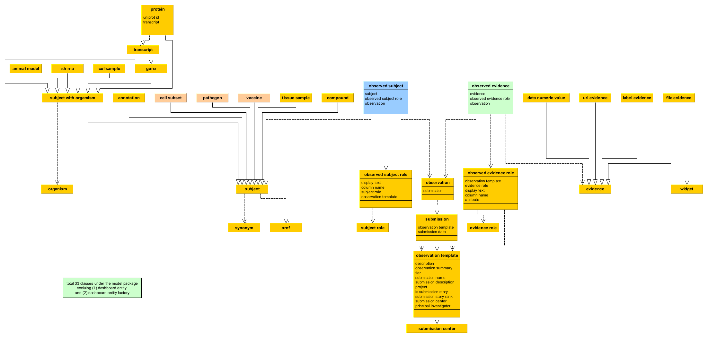
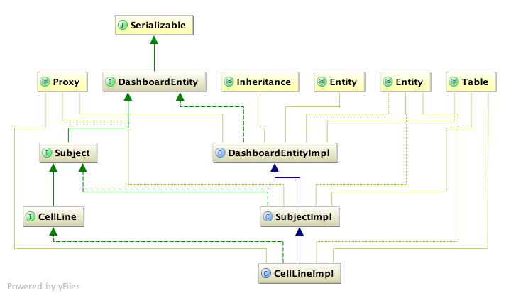
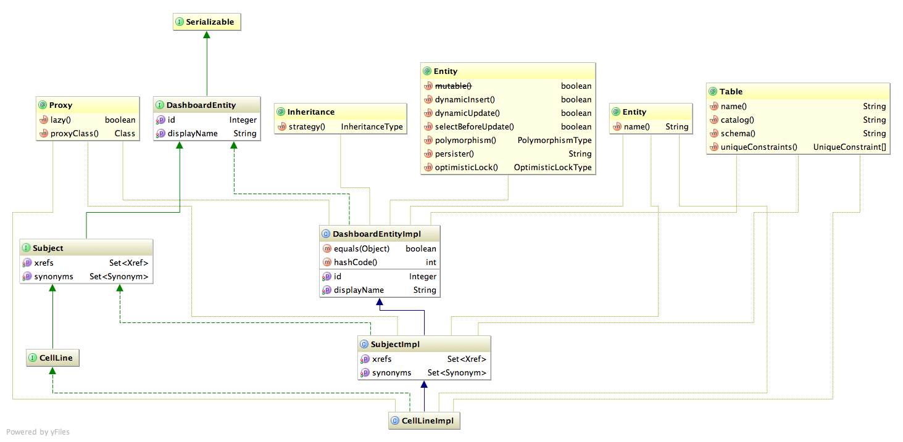

# HIPC Dashboard Pipeline
## Overview
This respository, hipc-dashboard-pipeline, provides code and data to generate submission files for the HIPC Dashboard (http://hipc-dashboard.org/).  The HIPC Dashboard itself resides in a [separate GitHub repository](https://github.com/floratos-lab/hipc-signature).

The HIPC Dashboard provides a web interface to the immune signatures curated as part of the HIPC Signatures II project (NIAID).  This initial version of the Dashboard focuses on vaccine reponse signatures, however, it is designed to be extendable to additional signature types.  Work on signatures of responses to infection is in progress.  

The focus of curation are the "response components", the biological features whose change is being measured.  Extensive supporting metadata is captured to characterize the experiment giving rise to each signtaure.  The intial response components curated and released on the Dashboard have been gene expression and cell-type frequency.  Work is also in progress on metabolites, pathways etc.

Although all of the original curated data files are made available on this site, it is the files output by the R pipeline, which contain data that has been standardized and reformated, which would be most suitable for consumption by other projects.  These processed files, described in more detail below, are found in the directories
* ./submissions - tab-delimited Dashboard load files, one file per signature
* ./reformatted_data - standardized versions of curated data in several formats including tab-delimited, RDS, Excel and Broad GMT (tab-delimited).

## Design
The basic Dashboard design was originated for the [Cancer Target Detection and Discovery Network (CTD2)](https://ctd2-dashboard.nci.nih.gov/dashboard), overseen by the Office of Cancer Genomics of the National Cancer Institute (NCI).  A more detailed discussion of the Dashboard architecture is available in the publication [Askoy et al. (2017)](https://pubmed.ncbi.nlm.nih.gov/29220450/).  The Dashboard is designed to be flexible and allows using data submission templates with an arbitrary number and type of data columns, with the format specified in the load files themselves. For the HIPC Dashboard project, the templates for different signature types vary only very slightly, but we briefly review the underlying aspects of its flexible architecture. The Dashboard is built on two classes of data.  The first, termed "subjects", comprises terms drawn from controlled vocabularies which are represented directly in the Dashboard database with all their underlying data. The second class, termed "evidence", is open and can be used to add additionnal annotation columns, such as free text or files, as needed for a particular submission.   The addition of new ontology-based data-types ("subjects") requires additions to the data model. 

## Curation
Curators enter data into Google-sheet based templates exactly as it appears in a publication.  This data is then standardized as needed using suitable ontologies.  The original annotations are also preserved for qualtity control and provenance.  The curation sheets contain several rows of headers used to guide the Dashboard load process but which are not of interest to the wider community.

The file "**HIPC Dashboard curation template fields.pdf**" in the pipeline root directly contains the complete specification for each field in the curation templates.

## Data Standardization
Standardization varies according to data type.  We use existing community standards wherever possible:
* Gene symbols - Curated gene symbols are updated to current HGNC/NCBI symbols based on (1) NCBI synonyms and (2) a manually created mapping table.  The later deals with specific problematic symbols found in the curated data, where examination of the original data is able to support a definite mapping.
* Cell types and markers - We create a mapping table to standardize the orignal cell type descriptions using terms from the Cell Ontology for cell types and Protein Ontology for additional type-defining markers.
* Vaccines - For influenza vaccines, the year is used to expand the vaccine into its three or four viral components.

## Pipeline Input: Curated data (./source_data)
Unprocessed, curated data is placed as tab-delimited spreadsheet files in ./source_data, one file per response component type.  These files are the input for the pipeline.
These are currently:
* HIPC Dashboard - Gene Expression.tsv
* HIPC Dashboard - Cell type Frequency.tsv

This directory also contains the various mapping and translation files required by the R pipeline script.

The curated response component data is also available in an Excel file, "HIPC Dashboard.xlsx", for easy review, however this file is not used by the script.

## R scripts (./R)
R scripts are in ./R. "generate_HIPC_submissions.R" is the main script. It expects to be called from its source location. It has a number of optional settings. In particular, one can currently choose to run the script for the gene data or the cell-type data (infection data to be added soon).

## Data Releases
The Dashboard database is reloaded in its entirety each time a new release is created.  When a new version of the data is ready, the code, input data and resulting output files are all committed together as a release.  

The file "**changelog.txt**" in the root directory lists all major changes in each release.

## Pipeline Output Files 
### Dashboard Submission files (./submissions)
This directory contains the Dashboard load files generated by the R pipeline script.
The submission files are tab-delimited.  The files are named using the pattern "hipc_<type>_<PMID>_<number>, where type is the type of response component ("gene"; or "ctf" for cell-type frequency), PMID is the PMID of the source publication, and "number" is the sequential count of this signature of this type within the publication.
	
Gene expression submission files are placed in the subdirectory "submissions/hipc_gene/".  
* Example: for the file **hipc_gene_21357945_1.txt**, "21357945" is the PMID of the publication, and "1" indicates the first signature of this type from that PMID.
	
Cell-type submissions are placed in the subdirectory "submissions/hipc_ctf/".
* Example: for the file **hipc_ctf_26726811_1.txt**, "ctf" indicates type "cell-type frequency", "26726811" is the PMID, and "1" indicates the first signature of this type for that PMID.

### Submission file format
The Dashboard submission load files contain the same columns as described in the curation document, with additions to support the requirements of the Dashboard itself, to preserve original curated values for fields updated by the pipeline, and to add separated-out fields for cell-type markers and ontology identifiers. Each file represents one signature in a denormalized manner. Because the "response_component" field for one signature many contain up to e.g. thousands of gene symbols, this element of the signature is treated differently than all other elements.
* multi-valued "subject" fields other than "response_component" (genes or vaccines) are split into as many columns as needed to represent each entry in single-valued fashion.  For example, a spreadsheet target_pathogen field containing three pathogens would be split into three separate columns on the same row, "target_pathogen_1", "target_pathogen_2" and "target_pathogen_3".  This currently applies to the fields "exposure_material" and "target_pathogen".
* "response_component" fields are split into a new row for each entry. For example, a signature with 100 genes will be expanded to 100 rows, each with 1 gene symbol in the response_component column. All other columns will be the same for each row. (This aspect of the Dashboard design allows in principle additional unique supporting evidence to be stored for each response_component (e.g. p-values for genes), however the current HIPC signatures curation project is not collecting data at this level of detail). 
* The original curated values for response_component appear in the "response_component_original" column.

The following additional convenience fields are also added by the pipeline for all template types
* **response_comp_orig_cnt** - the number of response components in originally curated signature (e.g. gene symbols)
* **response_comp_cnt** - the number of response components in the updated signature.
* **subm_obs_id** - the sequential count of a signature within all signatures of this type for a particular publication_reference_id (PMID).      
* **uniq_obs_id** - the original row number of a signature in the curation sheet.         
* **row_key** - the concatenation of the publication_reference_id, the subm_obs_id and the uniq_obs_id.
	
For easy inspection, CSV-formatted versions of the same files are also generated under "submissions/hipc_gene_csv/" and "submissions/hipc_ctf_csv/"

**Complete signature response component files** - Files containing just the complete list of response components for each signature are located in a further subdirectory, "files", for reach response component type, e.g. "submissions/hipc_gene/files".  An example is the file **hipc_gene_sig_21357945_3.txt** which lists six genes, one per line, that make up the third signature for that PMID.
	
### Additional columns for cell-type signatures	
For cell-type frequency signatures, the pipeline splits the original single field containing the curated cell types into several new columns.  An example containing multiple cell-types in a single signature can be seen in a signature from PMID 28854372 which contains the response components "CD86+ myeloid dendritic cells (mDCs); CCR7+ myeloid dendritic cells (mDCs); CD40/CD86+ monocytes; **CD38+ CD56-dim natural killer (NK) cells**".  
	
Below we examine the cell-type specific columns with example values.
* **response_component_original**: the originally curated value: CD38+ CD56-dim natural killer (NK) cells
* **response_component**: Cell Ontology name of the cell type : natural killer cell
* **cell_ontology_id**: Cell Ontology ID of the cell type : CL_0000623
* **proterm_and_extra**: a string beginning with "&" and followed first by any marker names found in the protein ontology, then any additional annotatons: & CD38+, CD56-dim
* **pro_ontology_id**: Protein Ontology IDs for cell-type markers: PR:000001408, PR:000001024	
* **fully_qualified_response_component**: a reconstructed single string describing the cell type with official names: natural killer cell & CD38+, CD56-dim	

	View the original submission file for the example in [csv format ](https://github.com/floratos-lab/hipc-dashboard-pipeline/blob/master/submissions/hipc_ctf_csv/hipc_ctf_28854372_3.csv) or download the tab-delimited [tab-delimited](https://github.com/floratos-lab/hipc-dashboard-pipeline/blob/master/submissions/hipc_ctf/hipc_ctf_28854372_3.txt) version.
	
### Log files
An additional directory (not checked-in to GitHub), "logfiles" is created.  After the script has run, this directory contains a number of files tracing the data transformations and final summary data, as well as "recreated_template" files that represent the data after all updates and transformations, in the same format as the original data.

### Reformatted data files (./reformatted_data)
The "recreated_template" files are in the same spreadsheet format as the original curated data.  These files represent the original data after all updates and transformations, and are provided in tab-delimited, RDS and Excel formats.  Files containing the "response components" for each signature are also provided in the tab-delimited Broad GMT format.

# Database Schema and Notes about Modules
## Core: Data structures and DAO methods
This section is excerpted from the [HIPC Dashboard software repository](https://github.com/floratos-lab/hipc-signature/blob/master/README.md#notes-about-modules).  Please visit that page for further details of the implementation of the HIPC Dashboard itself.

The main database schema is outlined below:

We are taking advantage of _factory pattern_ and also separating class definitions (interfaces) and their actual implementations (`*Impl`s) for convenience.
We basically try to convey the following basic ideas in our implementation:

1. Every item that is going to be persisted in the database is of type `DashboardEntity`.
2. Every `DashboardEntity` has a unique id, which is autogenerated by the database (_i.e._ when persisted in the database); therefore id spaces do not clash.
3. All new instances of the classes should be created via `DashboardFactory` -- this is for better handling of the semantics.

So let's take `Compound` as an example.
The class `Compound` is actually an interface that extends the `Subject` interface which, in turn, extends the `DashboardEntity` interface.
The interface determines which methods a class should provide.
The actual implementation of the methods goes into the class `CompoundImpl` which, programmatically speaking, implements `Compound`.
This is better explained with the following simple UML diagram:

The following UML diagram also shows properties and methods in a detailed manner:

Because of these implementation choices, the good practice for creating a new instance of a specific object is as follows:

	// Demonstration of how a new instance of an object should be created

	// Create a factory
	DashboardFactory dashboardFactory = new DashboardFactory();

	// Factory grabs the actual implementation and binds it to the object
	Compound compound = dashboardFactory.create(Compound.class);
	// Developer modifies the object through the methods defined in the interface
	String pyrethrinII = "COC(=O)C(\\C)=C\\C1C(C)(C)[C@H]1C(=O)O[C@@H]2C(C)=C(C(=O)C2)CC=CC=C";
	compound.setSmilesNotation(pyrethrinII);
	compound.setDisplayName("Pyrethrin II");

Furthermore, the interfaces do not know about the persistence details -- that is, column/table names and _etc_.
We do not empose a pre-set SQL schema onto the persistence layer, but instead let `Hibernate` deal with the details -- *i.e.* creating the schema.
So all `Hibernate` and `Persistence` annotations go into the _*Impl*_ classes which use the actual interfaces as *Proxy* (see the UML diagram above). 
The specific details -- database dialect, usernames, passwords, database names -- are all defined in the `signature.properties` file mentioned above.

Basic querying methods are implemented as part of the `DashboardDao`.
Developers do not have to deal with the configuration and/or initialization of the _Dao_ class, 
but rather they can get it through _Spring_ facilities, _e.g._:

	ApplicationContext appContext = new ClassPathXmlApplicationContext("classpath*:META-INF/spring/applicationContext.xml");
	DashboardDao dashboardDao = (DashboardDao) appContext.getBean("dashboardDao");

`DashboardDao` can be used to persist objects:

	Synonym synonym = dashboardFactory.create(Synonym.class);
	synonym.setDisplayName("Synonym 1");
	dashboardDao.save(synonym);

Normally, you don't have to worry about the `id` field.
When an object is created via `DashboardFactory`, it has an id of `null`.
When it gets persisted, the `id` field is updated with the automatically-generated value:

	Synonym synonym = dashboardFactory.create(Synonym.class);
	assert synonym.getId() == null;
	dashboardDao.save(synonym);
	assert synonym.getId() != null;

`DashboardDao` can also be used to acquire objects that are already in the database:

	// Grabs all compounds in the database
	List<Compound> allCompounds = dashboardDao.findEntities(Compound.class);

	// or more generic entities, for example all Subjects
	List<Subject> allSubjects = dashboardDao.findEntities(Subject.class);

or to conduct a find operation:

	List<Compound> compoundsBySmiles = dashboardDao.findCompoundsBySmilesNotation(pyrethrinII);

# References
Aksoy BA, Dancík V, Smith K, Mazerik JN, Ji Z, Gross B, Nikolova O, Jaber N, Califano A, Schreiber SL, Gerhard DS, Hermida LC, Jagu S, Sander C, Floratos A, Clemons PA. CTD2 Dashboard: a searchable web interface to connect validated results from the Cancer Target Discovery and Development Network. Database (Oxford). 2017 Jan 1;2017:bax054. doi: 10.1093/database/bax054. PMID: 29220450; PMCID: PMC5569694.
