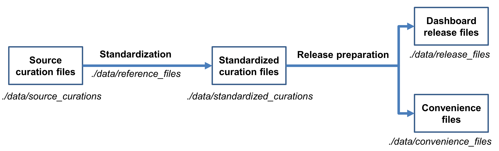

# HIPC Dashboard Pipeline
## Overview

The [Human Immunology Project Consortium (HIPC) Dashboard](http://hipc-dashboard.org/) 
is a web-application supporting the storage and dissemination of immune
signatures curated from published literature. This GitHub repository is
used for preparing data releases for the HIPC Dashboard. It includes
both the actual release files as well as the code used for generating
them. The HIPC Dashboard web-app itself is managed via a [separate GitHub repository](https://github.com/floratos-lab/hipc-signature).

Our main objective in this project is to standardize the representation
of immune signatures, i.e., of research findings that describe how
immune exposures (e.g., infection, immunization) modulate the abundance
of biologically important response components (e.g., genes, cell
subpopulations). Such findings are typically not presented in a
consistent format and may be found as text, tables, or images within
publications. To improve access and to promote reuse, we have developed
a data model that standardizes the content and context of published
immune signatures. The model is used as the basis for generating
[curation spreadsheets](./docs) which are utilized by
human experts to record immune signatures from published literature.
These spreadsheets are then further processed by the pipeline in this
GitHub repository. The pipeline performs quality control, enforces
consistent use of controlled vocabularies, and, finally, generates the
data release files which will be uploaded to the HIPC Dashboard.

The repository contents are as follows:

  - **./code**: contains the R code used for processing the source
    curation data and generating the Dashboard release files.

  - **./data**:
    
      - **./data/source_curations**: source curation spreadsheets, as
        provided by curators.

      - **./data/standardized_curations**: curation spreadsheets in denormalized form, after
        undergoing processing for quality control and standardization. This is the state from 
        which all other files are created, i.e. the convenience files and release files. 

      - **./data/reference_files**: resources used to support the
        standardization process, including controlled vocabularies from
        external sources and mapping files maintained by the project.
    
      - **./data/release_files**: Dashboard release files. These are
        transformed, partially denormalized spreadsheet files generated from the standardized
        curations. They are formatted as needed for uploading to the
        Dashboard.

      - **./data/convenience_files**: the standardized curations conveniently reformatted to support 
        human inspection and downstream computational analysis.

  - **./docs**: curation templates and column specification.

The overall workflow of the project is depicted below.

## Immune Signature Data Model

The figure above outlines the key elements of the immune signature data
model. These are:

  - **Immune exposure**: the immunological perturbation whose effect is
    measured by the immune signature.

  - **Response component**: the biological entity whose abundance is being
    quantified.

  - **Tissue**: the biological context where the abundance measurements are
    made.

  - **Cohort**: the group of individuals subjected to the immune exposure;
    they are the source of the biological material from which the
    abundance measurements are taken.

  - **Comparison**: the conditions under which differential abundance is
    assessed.

For each of these elements we define a number of associated data fields
used to collect element-specific information. As much as possible,
values for these fields come from controlled vocabularies, either
leveraging community standards (HUGO gene symbols for genes, Cell
Ontology terms for cell types, Vaccine Ontology ids for vaccines, etc.)
or utilizing term lists developed specifically for the needs of the
project. A specification of all available data fields can be found under
the [**./docs**](./docs) directory.

## Immune Signature Curation

Curators review selected publications, identify immune signatures
reported therein, and record the signature-related data into the
curation templates. Data is recorded as it appears in a publication and
then standardized using suitable controlled vocabularies. The
standardization is performed partly by the curators and partly by
post-curation script-assisted annotation. For some data
(tissue types, vaccines, pathogens) curators are asked to match
what is reported in the publication to standardized terms from specific
ontologies. For other data, such as gene symbols, the post-curation
process will ensure that these are valid HUGO symbols and rectify issues
such as spelling errors and use of deprecated terms. In all cases, the
original text from the publication is also preserved, to be used for
quality control and for maintaining proper provenance.

Dedicated templates are used for different types of immune
signatures (infection, vaccination) to accommodate the specific
data collection needs of each signature type. Blank copies ave available under
the [**./docs**](./docs) directory.

## Post-Curation Data Processing

The high-level post-curation data processing workflow is outlined in the
figure below.

### Standardization

Unprocessed data from the curation templates are stored as tab-delimited
spreadsheet files in the directory **./data/source_curations**. In
preparation for data release, the files undergo a quality control and
standardization process. The objective of the process is to identify and
correct discrepancies and to ensure consistent use of controlled
vocabularies. Some of the steps undertaken during this process include:

  - **Gene symbols** - Curated gene symbols are updated to current
    HGNC/NCBI symbols based on (1) NCBI synonyms and (2) a manually
    created mapping table. The later, where possible, resolves
    problematic symbols found in the curated data to their correct gene
    symbol, following manual re-examination of the original publication.

  - **Cell types and markers** - Measurement of cell type abundance
    typically involves flow cytometry experiments that utilize
    cell-marker based sorting. In these cases, Cell Ontology alone may
    not provide adequate resolution for the proper description of the
    cell types reported in an immune signature. To address this issue,
    we curate a mapping table to standardize the original publication
    cell type descriptions using terms from the Cell Ontology for cell
    types and Protein Ontology for additional type-defining markers.

  - **Vaccines** – For vaccination signatures, curators use the [Vaccine
    Ontology](https://www.ebi.ac.uk/ols/ontologies/vo) to code vaccines
    and the [NCBI Taxonomy](https://www.ncbi.nlm.nih.gov/taxonomy) to
    code the pathogens targeted by these vaccines. For influenza (and
    possibly other vaccines in the future) we remove the coding burden
    from the curators by utilizing a mapping file to perform this task.
    Curators only need to specify the vaccine using a year-based tag and
    then the coding information is retrieved by looking up the tag in
    the mapping file.

The curated files mentioned above as well as ancillary files utilized by
the standardization process (e.g., containing controlled vocabulary
terms from outside ontologies) are stored in **./data/reference_files**
and are updated with the latest versions prior to a Dashboard release.

### Release Preparation

The quality control and standardization process produces new, denormalized versions of
the source spreadsheets which are placed under **./data/standardized_curations**. 
These files then undergo further processing to generate the
final data release files which will be uploaded to the Dashboard. This
processing is essentially a straightforward repackaging of the
spreadsheets into a format appropriate for the upload scripts. It
involves splitting immune signatures into individual spreadsheet files, one
signature per file. The final release files are stored under **./data/release_files** and
have the same columns as the standardized curation files, with some additions
to support the requirements of the Dashboard itself and to preserve
original curated values for fields updated by the pipeline.

The release preparation process also generates a number of convenience files, i.e., 
partially re-normalized versions of the standardized curations. These files are available 
in spreadsheet format, to facilitate human inspection; and in the Broad GMT tab delimited file format, 
to support downstream computational processing. The files are stored under 
**./data/convenience_files**

Additional details about the processing pipeline can be found under the
**./data** directory.

## Release Versioning

The Dashboard database is reloaded in its entirety each time a new
release is created. This involves reprocessing all curation templates,
old and new, as described above. When the data processing is complete,
the entire repository is tagged with the new Dashboard release number.
This includes the pipeline code used to generate the release, the source
curation templates, all intermediate and support files, and the final
data release files.

The file **changelog.txt** in the root directory lists all major changes
to the pipeline code and process in each release. The file
**changelog-data.txt** in the root directory lists all major updates to
the curation templates and the data in each release.

## License

This project is licensed under the BSD 3-clause license. See
the [LICENSE.txt](./LICENSE.txt) file
for details.
